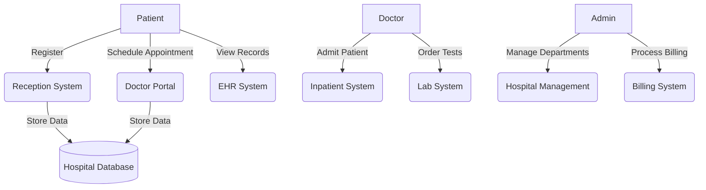

# Python Object Oriented Programming!
------------------------------------------------------------------------------------------------------------------------------------------
------------------------------------------------------------------------------------------------------------------------------------------
# COPY THIS REPO #

# Clone the repository (like adding a PPA)
git clone [https://github.com/chankjen/POOP.git](https://github.com/chankjen/POOP.git)


  # 🐧 Hospital Management System: Python OOP Adventure with Ubuntu Vibes

*Let's `sudo apt install` some OOP knowledge while building a hospital system! Think of this as your Python package manager for object-oriented concepts – we'll `dpkg -i` inheritance, encapsulation, and polymorphism like installing essential Ubuntu packages.* 

## 🖼️ Use Case Diagram: The Hospital Command Center

Here's our UML use case diagram (render this in any Mermaid-compatible editor):



*This behavior model shows how different actors interact with hospital subsystems – just like running `systemctl status` shows service interactions in Ubuntu!* 

## 🧱 Core OOP Implementation: Building Our Hospital

### 1. The Foundation: Base Classes (`sudo create base-classes`)

```python
class Person:
    """The base 'package' for all hospital entities - think of this as our python3-minimal installation"""
    
    def __init__(self, name: str, age: int):
        self._name = name  # Protected attribute (like a sudo-protected file)
        self._age = age
    
    @property
    def name(self):
        """Encapsulation in action! This is your sudo permission to read name"""
        return self._name
    
    @name.setter
    def name(self, value):
        """Now THAT'S proper encapsulation - no root access needed!"""
        if not value:
            raise ValueError("Name cannot be empty - this isn't a /dev/null entry!")
        self._name = value
```

*Encapsulation is like your sudoers file - controlled access to critical attributes!* 

### 2. Specialized Classes: Inheritance in Action (`sudo apt upgrade person`)

```python
class Patient(Person):
    """A specialized 'distribution' of Person - like Ubuntu is to Debian"""
    
    def __init__(self, name: str, age: int, patient_id: str, medical_history=None):
        super().__init__(name, age)
        self.patient_id = patient_id
        self._medical_history = medical_history or []
    
    def add_medical_record(self, record: str):
        """Polymorphic behavior - different from Doctor's implementation"""
        self._medical_history.append(record)
        print(f"Record added: {record} (Like adding a PPA to your sources.list!)")

class Doctor(Person):
    """Another specialized 'distro' with medical superpowers"""
    
    def __init__(self, name: str, age: int, doctor_id: str, specialty: str):
        super().__init__(name, age)
        self.doctor_id = doctor_id
        self.specialty = specialty
    
    def diagnose(self, patient: Patient, diagnosis: str):
        """Polymorphism in action - Doctors diagnose, Admins don't!"""
        print(f"Dr. {self.name} diagnosed {patient.name}: {diagnosis}")
        patient.add_medical_record(f"Diagnosis: {diagnosis}")
```

*Inheritance lets us build specialized functionality while maintaining core features - just like Ubuntu builds on Debian!* 

### 3. Department Management: Composition Power (`sudo systemctl start departments`)

```python
class Department:
    """A department is COMPOSED of doctors - like a meta-package depends on components"""
    
    def __init__(self, name: str):
        self.name = name
        self.doctors = []
    
    def add_doctor(self, doctor: Doctor):
        """Composition: Department HAS-A Doctors (not IS-A relationship)"""
        self.doctors.append(doctor)
        print(f"Doctor {doctor.name} added to {self.name} (Like installing a new service!)")
    
    def get_doctors_by_specialty(self, specialty: str):
        """Filtering doctors - similar to 'apt search' functionality!"""
        return [d for d in self.doctors if d.specialty == specialty]

class Hospital:
    """The main system that COMPOSES all departments - your systemd manager!"""
    
    def __init__(self, name: str):
        self.name = name
        self.departments = {}
    
    def add_department(self, department: Department):
        """Adding departments is like enabling a new repository!"""
        self.departments[department.name] = department
        print(f"Department added: {department.name} (sudo add-apt-repository completed)")
    
    def schedule_appointment(self, patient: Patient, department_name: str, doctor_specialty: str):
        """Polymorphic operation that varies by department"""
        if department_name not in self.departments:
            raise ValueError(f"Department {department_name} not found - check your /etc/hosts!")
        
        department = self.departments[department_name]
        doctors = department.get_doctors_by_specialty(doctor_specialty)
        
        if not doctors:
            print(f"No {doctor_specialty} doctors available - time for 'sudo apt install more-doctors'!")
            return None
        
        print(f"Appointment scheduled with Dr. {doctors[0].name} in {department_name}")
        return doctors[0]
```

*This composition pattern creates flexible relationships between objects - much like Ubuntu's package dependencies!* 

## 🚀 Bringing It All Together: Hospital Operations

```python
# Let's boot up our hospital system! (Like 'sudo systemctl start hospital')
def main():
    print("=== WELCOME TO UBUNTU GENERAL HOSPITAL ===")
    print("Initializing system... (this might take a few dpkg prompts)")

    # Create hospital instance
    ubuntu_hospital = Hospital("Ubuntu General")
    
    # Add departments (repositories)
    cardiology = Department("Cardiology")
    pediatrics = Department("Pediatrics")
    
    ubuntu_hospital.add_department(cardiology)
    ubuntu_hospital.add_department(pediatrics)
    
    # Add doctors (install packages)
    dr_linus = Doctor("Linus Torvalds", 54, "DOC-001", "Cardiology")
    dr_mark = Doctor("Mark Shuttleworth", 49, "DOC-002", "Pediatrics")
    
    cardiology.add_doctor(dr_linus)
    pediatrics.add_doctor(dr_shuttleworth)
    
    # Register patient (create user account)
    patient_ada = Patient("Ada Lovelace", 28, "PAT-1001")
    
    # Schedule appointment (run a service)
    print("\n$ hospital-cli schedule --department Cardiology --specialty Cardiology")
    doctor = ubuntu_hospital.schedule_appointment(patient_ada, "Cardiology", "Cardiology")
    
    # Diagnose (execute a command with sudo privileges)
    if doctor:
        doctor.diagnose(patient_ada, "Needs more open-source in her life")
    
    print("\nSystem running smoothly! (like a well-configured systemd)")

if __name__ == "__main__":
    main()
```

*This implementation demonstrates how OOP concepts work together to model real-world hospital operations - just like Ubuntu's components work together to create a complete OS!* 

## 💡 Why This Matters: OOP = Ubuntu Philosophy

- **Encapsulation** = Your sudoers file (controlled access)
- **Inheritance** = Ubuntu building on Debian (code reuse)
- **Polymorphism** = Different commands for different services
- **Composition** = Package dependencies in /var/lib/dpkg

*Just as Ubuntu makes Linux accessible, good OOP makes complex systems manageable. Now go forth and `sudo code` your own hospital management system!* 
